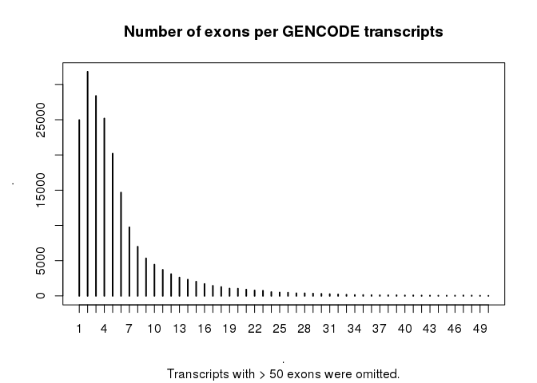
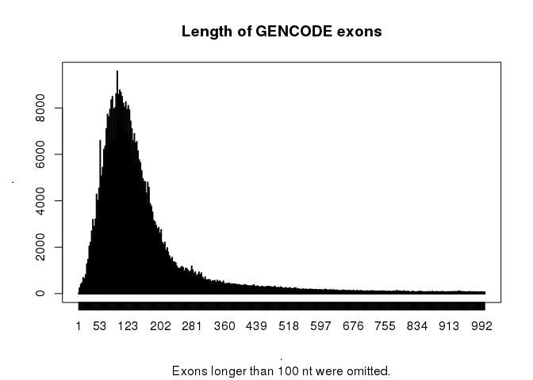
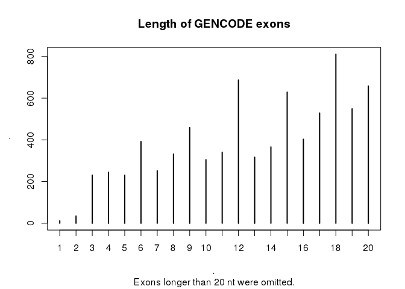
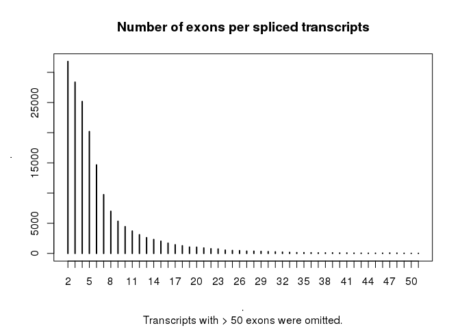
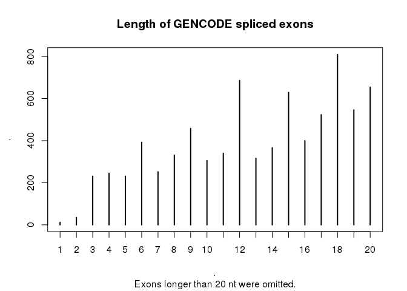
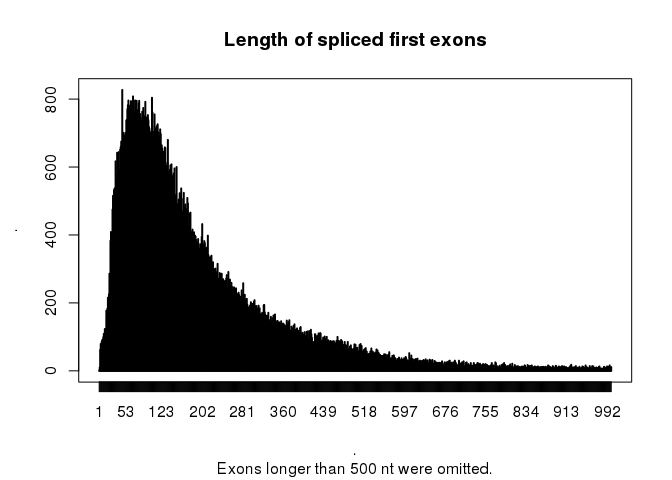

# Exon lenghts in GENCODE 26
Charles Plessy  

I am intersted in the length of first exons.  To get an estimate of what to expect,
I am using GENCODE 26.  However, I get surprising results.

This analysis is done in R.  First, let's load R libraries.


```r
library(magrittr)
library(GenomicRanges)
```

Then, let's download GENCODE 26.


```bash
wget --quiet --continue ftp://ftp.sanger.ac.uk/pub/gencode/Gencode_human/release_26/gencode.v26.annotation.gtf.gz
```

Then, let's load GENCODE 26 in R as a GenomicRanges object and discard all
non-exon features


```r
g <- rtracklayer::import.gff("gencode.v26.annotation.gtf.gz")

summary(g)
```

```
## [1] "GRanges object with 2604486 ranges and 20 metadata columns"
```

```r
colnames(mcols(g))
```

```
##  [1] "source"                   "type"                    
##  [3] "score"                    "phase"                   
##  [5] "gene_id"                  "gene_type"               
##  [7] "gene_name"                "level"                   
##  [9] "havana_gene"              "transcript_id"           
## [11] "transcript_type"          "transcript_name"         
## [13] "transcript_support_level" "tag"                     
## [15] "havana_transcript"        "exon_number"             
## [17] "exon_id"                  "ont"                     
## [19] "protein_id"               "ccdsid"
```

```r
table(g$type)
```

```
## 
##           gene     transcript           exon            CDS    start_codon 
##          58219         199324        1194547         710618          83245 
##     stop_codon            UTR Selenocysteine 
##          74994         283420            119
```

```r
g <- g[g$type == "exon"]
mcols(g) %<>% droplevels
```

Many transcripts have more than one exon.


```r
tapply(g$exon_number %>% as.numeric, g$transcript_id, max) %>% table %>% head(50) %>%
  plot(main = "Number of exons per GENCODE transcripts", sub = "Transcripts with > 50 exons were omitted.")
```

<!-- -->

Exons tend to be short.


```r
width(g) %>% summary
```

```
##     Min.  1st Qu.   Median     Mean  3rd Qu.     Max. 
##      1.0     88.0    129.0    249.3    198.0 205000.0
```

```r
width(g) %>% table %>% head(1000) %>%
  plot(main = "Length of GENCODE exons", sub = "Exons longer than 100 nt were omitted.")
```

<!-- -->

Some Exons are very short; they can be microexons.


```r
width(g) %>% summary
```

```
##     Min.  1st Qu.   Median     Mean  3rd Qu.     Max. 
##      1.0     88.0    129.0    249.3    198.0 205000.0
```

```r
width(g) %>% table %>% head(20) %>%
  plot(main = "Length of GENCODE exons", sub = "Exons longer than 20 nt were omitted.")
```

<!-- -->

Let's focused on spliced transcripts.


```r
spliced <- tapply(g$exon_number %>% as.numeric, g$transcript_id, max) > 1
gs <- g[g$transcript_id %in% names(which(spliced))]
summary(gs)
```

```
## [1] "GRanges object with 1169596 ranges and 20 metadata columns"
```

```r
tapply(gs$exon_number %>% as.numeric, gs$transcript_id, max) %>%
  table %>% head(50) %>%
  plot(main = "Number of exons per spliced transcripts", sub = "Transcripts with > 50 exons were omitted.")
```

<!-- -->

```r
width(gs) %>% table %>% head(20) %>%
  plot( main = "Length of GENCODE spliced exons"
      , sub = "Exons longer than 20 nt were omitted.")
```

<!-- -->

And within them, let's focus on first exons.  Even within them, there are microexons.
I find this surprising.


```r
gs1 <- gs[gs$exon_number == 1]

width(gs1) %>% summary
```

```
##    Min. 1st Qu.  Median    Mean 3rd Qu.    Max. 
##       1      83     148     237     271   11370
```

```r
width(gs1) %>% table %>% head(20) %>%
  plot(main = "Length of spliced first exons", sub = "Exons longer than 20 nt were omitted.")
```

<!-- -->

Altogether, the size distribution of first spliced exons is not very different from
all the exons together.


```r
width(gs1) %>% table %>% head(1000) %>%
  plot(main = "Length of spliced first exons", sub = "Exons longer than 500 nt were omitted.")
```

<!-- -->

Examples


```r
options("showTailLines"=Inf) # http://stackoverflow.com/questions/16949545/show-all-lines-in-genomicrange-package-output

gs1[width(gs1) < 3]
```

```
## GRanges object with 11 ranges and 20 metadata columns:
##        seqnames                 ranges strand |   source     type
##           <Rle>              <IRanges>  <Rle> | <factor> <factor>
##    [1]     chr5 [136365253, 136365254]      - |   HAVANA     exon
##    [2]     chr5 [136365253, 136365254]      - |   HAVANA     exon
##    [3]     chr5 [136365253, 136365254]      - |   HAVANA     exon
##    [4]     chr5 [136365253, 136365254]      - |   HAVANA     exon
##    [5]     chr5 [136365253, 136365254]      - |   HAVANA     exon
##    [6]     chr7 [ 78627120,  78627121]      - |   HAVANA     exon
##    [7]     chr9 [  2181676,   2181676]      + |   HAVANA     exon
##    [8]     chr9 [132978840, 132978841]      + |   HAVANA     exon
##    [9]    chr12 [ 79793863,  79793864]      - |   HAVANA     exon
##   [10]    chr19 [  1013241,   1013242]      - |   HAVANA     exon
##   [11]    chr19 [  1526997,   1526998]      + |   HAVANA     exon
##            score     phase            gene_id      gene_type   gene_name
##        <numeric> <integer>        <character>    <character> <character>
##    [1]      <NA>      <NA> ENSG00000069018.17 protein_coding       TRPC7
##    [2]      <NA>      <NA> ENSG00000069018.17 protein_coding       TRPC7
##    [3]      <NA>      <NA> ENSG00000069018.17 protein_coding       TRPC7
##    [4]      <NA>      <NA> ENSG00000069018.17 protein_coding       TRPC7
##    [5]      <NA>      <NA> ENSG00000069018.17 protein_coding       TRPC7
##    [6]      <NA>      <NA> ENSG00000187391.19 protein_coding       MAGI2
##    [7]      <NA>      <NA> ENSG00000080503.22 protein_coding     SMARCA2
##    [8]      <NA>      <NA> ENSG00000165702.13 protein_coding       GFI1B
##    [9]      <NA>      <NA> ENSG00000058272.16 protein_coding    PPP1R12A
##   [10]      <NA>      <NA> ENSG00000182087.12 protein_coding     TMEM259
##   [11]      <NA>      <NA> ENSG00000185988.11 protein_coding        PLK5
##              level           havana_gene     transcript_id
##        <character>           <character>       <character>
##    [1]           2  OTTHUMG00000189265.2 ENST00000503275.5
##    [2]           2  OTTHUMG00000189265.2 ENST00000352189.7
##    [3]           2  OTTHUMG00000189265.2 ENST00000514963.5
##    [4]           1  OTTHUMG00000189265.2 ENST00000378459.6
##    [5]           2  OTTHUMG00000189265.2 ENST00000502753.3
##    [6]           1 OTTHUMG00000130697.18 ENST00000517762.2
##    [7]           2 OTTHUMG00000019445.12 ENST00000639760.1
##    [8]           2  OTTHUMG00000020848.4 ENST00000372123.4
##    [9]           2  OTTHUMG00000170100.5 ENST00000548908.2
##   [10]           2  OTTHUMG00000181905.6 ENST00000593068.6
##   [11]           1  OTTHUMG00000180073.4 ENST00000588430.2
##                transcript_type transcript_name transcript_support_level
##                    <character>     <character>              <character>
##    [1] nonsense_mediated_decay       TRPC7-002                        5
##    [2]          protein_coding       TRPC7-003                        5
##    [3] nonsense_mediated_decay       TRPC7-004                        5
##    [4]          protein_coding       TRPC7-005                        5
##    [5]          protein_coding       TRPC7-006                        5
##    [6]    processed_transcript       MAGI2-008                        5
##    [7]          protein_coding     SMARCA2-056                     <NA>
##    [8]          protein_coding       GFI1B-001                        5
##    [9]         retained_intron    PPP1R12A-006                        5
##   [10] nonsense_mediated_decay     TMEM259-003                        5
##   [11]          protein_coding        PLK5-003                        5
##                              tag    havana_transcript exon_number
##                      <character>          <character> <character>
##    [1]                      <NA> OTTHUMT00000366976.2           1
##    [2]                      CCDS OTTHUMT00000366977.3           1
##    [3]                      <NA> OTTHUMT00000366978.2           1
##    [4]                      CCDS OTTHUMT00000366979.2           1
##    [5]                     basic OTTHUMT00000366980.3           1
##    [6]                  exp_conf OTTHUMT00000344257.3           1
##    [7] RNA_Seq_supported_partial OTTHUMT00000490252.2           1
##    [8]                      CCDS OTTHUMT00000054809.3           1
##    [9]                      <NA> OTTHUMT00000407323.2           1
##   [10]              cds_start_NF OTTHUMT00000474031.2           1
##   [11]                  exp_conf OTTHUMT00000449629.3           1
##                  exon_id         ont        protein_id      ccdsid
##              <character> <character>       <character> <character>
##    [1] ENSE00002322790.2        <NA> ENSP00000421571.2        <NA>
##    [2] ENSE00002322790.2        <NA> ENSP00000330322.5 CCDS54905.1
##    [3] ENSE00002322790.2        <NA> ENSP00000426870.2        <NA>
##    [4] ENSE00002322790.2        <NA> ENSP00000367720.3 CCDS54906.1
##    [5] ENSE00002322790.2        <NA> ENSP00000424854.3        <NA>
##    [6] ENSE00003773007.1        <NA>              <NA>        <NA>
##    [7] ENSE00003804220.1        <NA> ENSP00000492585.1        <NA>
##    [8] ENSE00003763989.1        <NA> ENSP00000361196.1 CCDS48049.1
##    [9] ENSE00002347749.2        <NA>              <NA>        <NA>
##   [10] ENSE00003732965.1        <NA> ENSP00000475704.2        <NA>
##   [11] ENSE00003740607.1        <NA> ENSP00000465896.2        <NA>
##   -------
##   seqinfo: 25 sequences from an unspecified genome; no seqlengths
```

```r
options("showTailLines"=NULL)
```
