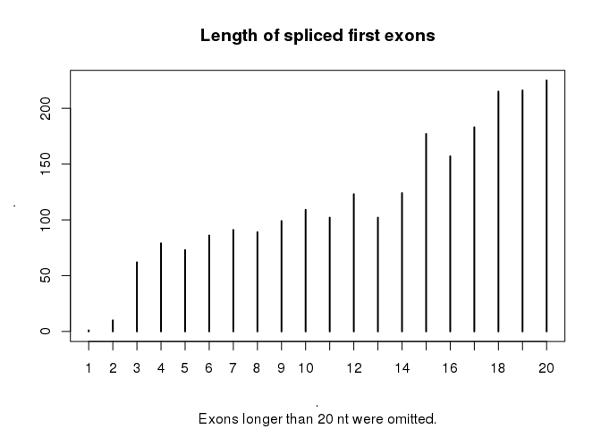

# Micro-first exons in GENCODE 26
Charles Plessy  


```r
knitr::opts_chunk$set(cache = TRUE)
```

## The question

I am interested in the length of first exons.  To get an estimate of what to expect,
I inspected the contents of GENCODE 26.  I am surprised to find very small first
exons, as I do not see how these could be produced by splicing: how could the
spliceosome handle a donor fragment that is only a few nucleotides long ?

So my question is *what do these micro-first exons repesent*.  Are they just
bugs in processing pipelines ?  Do they represent processed transcripts (in which
case its short length is not in contradiction with splicing mechanisms).  Or
is there something else I am missing ?

## Data load and preparation

This analysis is done in R.  First, let's load R libraries.


```r
library(magrittr)
library(GenomicRanges)
```

Then, let's download GENCODE 26.


```bash
wget --quiet --continue ftp://ftp.sanger.ac.uk/pub/gencode/Gencode_human/release_26/gencode.v26.annotation.gtf.gz
```

Then, let's load GENCODE 26 in R as a GenomicRanges object and select all
exon features.


```r
g <- rtracklayer::import.gff("gencode.v26.annotation.gtf.gz")
summary(g)
```

```
## [1] "GRanges object with 2604486 ranges and 20 metadata columns"
```

```r
colnames(mcols(g))
```

```
##  [1] "source"                   "type"                    
##  [3] "score"                    "phase"                   
##  [5] "gene_id"                  "gene_type"               
##  [7] "gene_name"                "level"                   
##  [9] "havana_gene"              "transcript_id"           
## [11] "transcript_type"          "transcript_name"         
## [13] "transcript_support_level" "tag"                     
## [15] "havana_transcript"        "exon_number"             
## [17] "exon_id"                  "ont"                     
## [19] "protein_id"               "ccdsid"
```

```r
table(g$type)
```

```
## 
##           gene     transcript           exon            CDS    start_codon 
##          58219         199324        1194547         710618          83245 
##     stop_codon            UTR Selenocysteine 
##          74994         283420            119
```

```r
ge <- g[g$type == "exon"]
mcols(ge) %<>% droplevels
```

## Exon lengths and number

Many transcripts have more than one exon.


```r
tapply(ge$exon_number %>% as.numeric, ge$transcript_id, max) %>% table %>% head(50) %>%
  plot(main = "Number of exons per GENCODE transcripts", sub = "Transcripts with > 50 exons were omitted.")
```

<!-- -->

Exons tend to be short.


```r
width(ge) %>% summary
```

```
##     Min.  1st Qu.   Median     Mean  3rd Qu.     Max. 
##      1.0     88.0    129.0    249.3    198.0 205000.0
```

```r
width(ge) %>% table %>% head(1000) %>%
  plot(main = "Length of GENCODE exons", sub = "Exons longer than 100 nt were omitted.")
```

<!-- -->

Some Exons are very short; they can be microexons.


```r
width(ge) %>% table %>% head(20) %>%
  plot(main = "Length of shortest GENCODE exons", sub = "Exons longer than 20 nt were omitted.")
```

<!-- -->

## First exons of spliced transcripts

Let's focus on spliced transcripts.


```r
spliced <- tapply(ge$exon_number %>% as.numeric, ge$transcript_id, max) > 1
gs <- ge[ge$transcript_id %in% names(which(spliced))]
summary(gs)
```

```
## [1] "GRanges object with 1169596 ranges and 20 metadata columns"
```

```r
tapply(gs$exon_number %>% as.numeric, gs$transcript_id, max) %>%
  table %>% head(50) %>%
  plot(main = "Number of exons per spliced transcripts", sub = "Transcripts with > 50 exons were omitted.")
```

<!-- -->

```r
width(gs) %>% table %>% head(20) %>%
  plot( main = "Length of shortest GENCODE spliced exons"
      , sub = "Exons longer than 20 nt were omitted.")
```

<!-- -->

And within them, let's focus on first exons.  Altogether, their size distribution
is not very different from all the exons together.


```r
gs1 <- gs[gs$exon_number == 1]

width(gs1) %>% summary
```

```
##    Min. 1st Qu.  Median    Mean 3rd Qu.    Max. 
##       1      83     148     237     271   11370
```

```r
width(gs1) %>% table %>% head(1000) %>%
  plot(main = "Length of spliced first exons", sub = "Exons longer than 500 nt were omitted.")
```

<!-- -->

Surprisingly, even within first exons, there are microexons.


```r
width(gs1) %>% table %>% head(20) %>%
  plot(main = "Length of spliced first exons", sub = "Exons longer than 20 nt were omitted.")
```

<!-- -->

## Examples

Inspection in the UCSC browser suggested that many of these micro-first exons
coincided with translation start sites.  Indeed, it seems to happen often, but
not systematically.


```r
options(width=110)
options("showTailLines"=Inf) # http://stackoverflow.com/questions/16949545/show-all-lines-in-genomicrange-package-output

x <- g[g$transcript_id %in% gs1[width(gs1) < 4]$transcript_id]

# For display purposes, let's give names to each entry, and re-sort the names
# of the metadata's columns.

names(x) <- x$transcript_name

mcols(x) <- mcols(x)[,c("type", "transcript_type", "gene_id",
  "source", "gene_type", "transcript_id", "level", "havana_gene",  
  "transcript_name", "transcript_support_level", "tag", "havana_transcript", 
  "exon_number", "exon_id", "ont", "protein_id", "ccdsid", "score", "phase",
  "gene_name")]

x[x$type %in% c("start_codon", "exon") & x$exon_number == 1]
```

```
## GRanges object with 101 ranges and 20 metadata columns:
##                     seqnames                 ranges strand |        type                    transcript_type
##                        <Rle>              <IRanges>  <Rle> |    <factor>                        <character>
##            SZT2-007     chr1 [ 43437506,  43437508]      + |        exon               processed_transcript
##           TNNI1-006     chr1 [201422019, 201422021]      - |        exon                     protein_coding
##           MPV17-004     chr2 [ 27323052,  27323054]      - |        exon                     protein_coding
##            DQX1-004     chr2 [ 74523923,  74523925]      - |        exon            nonsense_mediated_decay
##         ST3GAL5-067     chr2 [ 85888824,  85888826]      - |        exon            nonsense_mediated_decay
##             FAP-201     chr2 [162242996, 162242998]      - |        exon                     protein_coding
##             FAP-201     chr2 [162242996, 162242998]      - | start_codon                     protein_coding
##            SPEG-021     chr2 [219491867, 219491869]      + |        exon                     protein_coding
##           TSEN2-008     chr3 [ 12529871,  12529873]      + |        exon                     protein_coding
##           P4HTM-012     chr3 [ 49001626,  49001628]      + |        exon                     protein_coding
##    ABHD14A-ACY1-022     chr3 [ 51978080,  51978082]      + |        exon            nonsense_mediated_decay
##             PXK-003     chr3 [ 58409616,  58409618]      + |        exon                     protein_coding
##            GMNC-001     chr3 [190862613, 190862615]      - |        exon                     protein_coding
##            GMNC-001     chr3 [190862613, 190862615]      - | start_codon                     protein_coding
##           RUBCN-004     chr3 [197701708, 197701710]      - |        exon                     protein_coding
##           TGFBI-019     chr5 [136047418, 136047420]      + |        exon                     protein_coding
##           TRPC7-002     chr5 [136365253, 136365254]      - |        exon            nonsense_mediated_decay
##           TRPC7-002     chr5 [136365253, 136365254]      - | start_codon            nonsense_mediated_decay
##           TRPC7-003     chr5 [136365253, 136365254]      - |        exon                     protein_coding
##           TRPC7-003     chr5 [136365253, 136365254]      - | start_codon                     protein_coding
##           TRPC7-004     chr5 [136365253, 136365254]      - |        exon            nonsense_mediated_decay
##           TRPC7-004     chr5 [136365253, 136365254]      - | start_codon            nonsense_mediated_decay
##           TRPC7-005     chr5 [136365253, 136365254]      - |        exon                     protein_coding
##           TRPC7-005     chr5 [136365253, 136365254]      - | start_codon                     protein_coding
##           TRPC7-006     chr5 [136365253, 136365254]      - |        exon                     protein_coding
##           TRPC7-006     chr5 [136365253, 136365254]      - | start_codon                     protein_coding
##           OFCC1-019     chr6 [  9908518,   9908520]      - |        exon            nonsense_mediated_decay
##         SLC17A1-003     chr6 [ 25831994,  25831996]      - |        exon            nonsense_mediated_decay
##            LST1-024     chr6 [ 31587316,  31587318]      + |        exon                     protein_coding
##           KCNQ5-005     chr6 [ 73003996,  73003998]      + |        exon                     protein_coding
##            FIG4-004     chr6 [109701720, 109701722]      + |        exon                     protein_coding
##            FIG4-004     chr6 [109701720, 109701722]      + | start_codon                     protein_coding
##            AMD1-004     chr6 [110892825, 110892827]      + |        exon            nonsense_mediated_decay
##             MYB-004     chr6 [135186018, 135186020]      + |        exon                     protein_coding
##      AC005281.1-004     chr7 [ 12504544,  12504546]      + |        exon                     protein_coding
##      AC005281.1-004     chr7 [ 12504544,  12504546]      + | start_codon                     protein_coding
##           MAGI2-008     chr7 [ 78627120,  78627121]      - |        exon               processed_transcript
##           SRPK2-003     chr7 [105132791, 105132793]      - |        exon            nonsense_mediated_decay
##           SRPK2-003     chr7 [105132791, 105132793]      - | start_codon            nonsense_mediated_decay
##           SYPL1-008     chr7 [106112140, 106112142]      - |        exon            nonsense_mediated_decay
##         SMARCA2-056     chr9 [  2181676,   2181676]      + |        exon                     protein_coding
##        KIAA2026-006     chr9 [  5913858,   5913860]      - |        exon               processed_transcript
##            TLN1-006     chr9 [ 35706196,  35706198]      - |        exon                    retained_intron
##           TRPM3-009     chr9 [ 70862908,  70862910]      - |        exon                     protein_coding
##           TRPM3-009     chr9 [ 70862908,  70862910]      - | start_codon                     protein_coding
##           TRPM3-011     chr9 [ 70862908,  70862910]      - |        exon                     protein_coding
##           TRPM3-011     chr9 [ 70862908,  70862910]      - | start_codon                     protein_coding
##           TRPM3-012     chr9 [ 70862908,  70862910]      - |        exon                     protein_coding
##           TRPM3-012     chr9 [ 70862908,  70862910]      - | start_codon                     protein_coding
##           TRPM3-015     chr9 [ 70862908,  70862910]      - |        exon                     protein_coding
##           TRPM3-015     chr9 [ 70862908,  70862910]      - | start_codon                     protein_coding
##           TRPM3-016     chr9 [ 70862908,  70862910]      - |        exon                     protein_coding
##           TRPM3-016     chr9 [ 70862908,  70862910]      - | start_codon                     protein_coding
##          LRSAM1-011     chr9 [127473929, 127473931]      + |        exon               processed_transcript
##          PRRC2B-005     chr9 [131487292, 131487294]      + |        exon                     protein_coding
##           GFI1B-001     chr9 [132978840, 132978841]      + |        exon                     protein_coding
##          DNAJC4-012    chr11 [ 64231962,  64231964]      + |        exon                    retained_intron
##           GAPDH-201    chr12 [  6536605,   6536607]      + |        exon                     protein_coding
##           GAPDH-201    chr12 [  6536605,   6536607]      + | start_codon                     protein_coding
##        PPP1R12A-006    chr12 [ 79793863,  79793864]      - |        exon                    retained_intron
##             PAH-018    chr12 [102852815, 102852817]      - |        exon                     protein_coding
##           SEPT4-201    chr17 [ 58527142,  58527144]      - |        exon                     protein_coding
##           SEPT4-201    chr17 [ 58527142,  58527144]      - | start_codon                     protein_coding
##           THOC1-202    chr18 [   265534,    265536]      - |        exon                     protein_coding
##         TMEM259-003    chr19 [  1013241,   1013242]      - |        exon            nonsense_mediated_decay
##          POLR2E-014    chr19 [  1095259,   1095261]      - |        exon                     protein_coding
##            PLK5-003    chr19 [  1526997,   1526998]      + |        exon                     protein_coding
##            PLK5-003    chr19 [  1526997,   1526998]      + | start_codon                     protein_coding
##           MKNK2-011    chr19 [  2041840,   2041842]      - |        exon            nonsense_mediated_decay
##            NFIC-011    chr19 [  3359683,   3359685]      + |        exon                     protein_coding
##            NFIC-011    chr19 [  3359683,   3359685]      + | start_codon                     protein_coding
##    CTB-50L17.10-003    chr19 [  4475349,   4475351]      + |        exon            nonsense_mediated_decay
##            ILF3-004    chr19 [ 10670606,  10670608]      + |        exon                     protein_coding
##            ILF3-004    chr19 [ 10670606,  10670608]      + | start_codon                     protein_coding
##            ILF3-006    chr19 [ 10670606,  10670608]      + |        exon                     protein_coding
##            ILF3-006    chr19 [ 10670606,  10670608]      + | start_codon                     protein_coding
##            ILF3-005    chr19 [ 10670606,  10670608]      + |        exon                     protein_coding
##            ILF3-005    chr19 [ 10670606,  10670608]      + | start_codon                     protein_coding
##            NFIX-006    chr19 [ 13024032,  13024034]      + |        exon                     protein_coding
##            NFIX-006    chr19 [ 13024032,  13024034]      + | start_codon                     protein_coding
##           ZNF85-003    chr19 [ 20923401,  20923403]      + |        exon                     protein_coding
##           ZNF85-003    chr19 [ 20923401,  20923403]      + | start_codon                     protein_coding
##   RP11-255H23.2-001    chr19 [ 23790772,  23790774]      + |        exon transcribed_unprocessed_pseudogene
##           AP2S1-003    chr19 [ 46850764,  46850766]      - |        exon                     protein_coding
##           AP2S1-003    chr19 [ 46850764,  46850766]      - | start_codon                     protein_coding
##            EMP3-007    chr19 [ 48325608,  48325610]      + |        exon                     protein_coding
##          NELFCD-002    chr20 [ 58989019,  58989021]      + |        exon                    retained_intron
##          PKNOX1-002    chr21 [ 42974662,  42974664]      + |        exon                    retained_intron
##          TXNRD2-009    chr22 [ 19898039,  19898041]      - |        exon                     non_stop_decay
##            PES1-011    chr22 [ 30588021,  30588023]      - |        exon                    retained_intron
##            MPST-005    chr22 [ 37019772,  37019774]      + |        exon                     protein_coding
##         DENND6B-005    chr22 [ 50318965,  50318967]      - |        exon                    retained_intron
##            PIGA-002     chrX [ 15335501,  15335503]      - |        exon                     protein_coding
##           THOC2-003     chrX [123621157, 123621159]      - |        exon                     protein_coding
##          CD99L2-006     chrX [150814862, 150814864]      - |        exon                     protein_coding
##          RPS4Y2-001     chrY [ 20756164,  20756166]      + |        exon                     protein_coding
##          RPS4Y2-001     chrY [ 20756164,  20756166]      + | start_codon                     protein_coding
##            DAZ4-005     chrY [ 24834127,  24834129]      + |        exon                     protein_coding
##            DAZ4-005     chrY [ 24834127,  24834129]      + | start_codon                     protein_coding
##            DAZ4-003     chrY [ 24834127,  24834129]      + |        exon                     protein_coding
##            DAZ4-003     chrY [ 24834127,  24834129]      + | start_codon                     protein_coding
##                                gene_id   source                          gene_type     transcript_id
##                            <character> <factor>                        <character>       <character>
##            SZT2-007 ENSG00000198198.15   HAVANA                     protein_coding ENST00000470897.2
##           TNNI1-006 ENSG00000159173.18   HAVANA                     protein_coding ENST00000555948.5
##           MPV17-004 ENSG00000115204.14   HAVANA                     protein_coding ENST00000402310.5
##            DQX1-004 ENSG00000144045.13   HAVANA                     protein_coding ENST00000418139.5
##         ST3GAL5-067 ENSG00000115525.17   HAVANA                     protein_coding ENST00000640222.1
##             FAP-201 ENSG00000078098.13  ENSEMBL                     protein_coding ENST00000627638.2
##             FAP-201 ENSG00000078098.13  ENSEMBL                     protein_coding ENST00000627638.2
##            SPEG-021 ENSG00000072195.14   HAVANA                     protein_coding ENST00000412982.5
##           TSEN2-008 ENSG00000154743.17   HAVANA                     protein_coding ENST00000412698.2
##           P4HTM-012 ENSG00000178467.17   HAVANA                     protein_coding ENST00000472796.2
##    ABHD14A-ACY1-022 ENSG00000114786.16   HAVANA                     protein_coding ENST00000636264.1
##             PXK-003 ENSG00000168297.15   HAVANA                     protein_coding ENST00000493474.1
##            GMNC-001  ENSG00000205835.8   HAVANA                     protein_coding ENST00000442080.5
##            GMNC-001  ENSG00000205835.8   HAVANA                     protein_coding ENST00000442080.5
##           RUBCN-004 ENSG00000145016.15   HAVANA                     protein_coding ENST00000415452.5
##           TGFBI-019 ENSG00000120708.16   HAVANA                     protein_coding ENST00000604555.5
##           TRPC7-002 ENSG00000069018.17   HAVANA                     protein_coding ENST00000503275.5
##           TRPC7-002 ENSG00000069018.17   HAVANA                     protein_coding ENST00000503275.5
##           TRPC7-003 ENSG00000069018.17   HAVANA                     protein_coding ENST00000352189.7
##           TRPC7-003 ENSG00000069018.17   HAVANA                     protein_coding ENST00000352189.7
##           TRPC7-004 ENSG00000069018.17   HAVANA                     protein_coding ENST00000514963.5
##           TRPC7-004 ENSG00000069018.17   HAVANA                     protein_coding ENST00000514963.5
##           TRPC7-005 ENSG00000069018.17   HAVANA                     protein_coding ENST00000378459.6
##           TRPC7-005 ENSG00000069018.17   HAVANA                     protein_coding ENST00000378459.6
##           TRPC7-006 ENSG00000069018.17   HAVANA                     protein_coding ENST00000502753.3
##           TRPC7-006 ENSG00000069018.17   HAVANA                     protein_coding ENST00000502753.3
##           OFCC1-019 ENSG00000181355.20   HAVANA                     protein_coding ENST00000469656.5
##         SLC17A1-003 ENSG00000124568.10   HAVANA                     protein_coding ENST00000377886.6
##            LST1-024 ENSG00000204482.10   HAVANA                     protein_coding ENST00000490742.5
##           KCNQ5-005 ENSG00000185760.15   HAVANA                     protein_coding ENST00000443915.1
##            FIG4-004 ENSG00000112367.10   HAVANA                     protein_coding ENST00000454215.5
##            FIG4-004 ENSG00000112367.10   HAVANA                     protein_coding ENST00000454215.5
##            AMD1-004 ENSG00000123505.15   HAVANA                     protein_coding ENST00000465404.2
##             MYB-004 ENSG00000118513.18   HAVANA                     protein_coding ENST00000430686.2
##      AC005281.1-004  ENSG00000226690.7   HAVANA                     protein_coding ENST00000636804.1
##      AC005281.1-004  ENSG00000226690.7   HAVANA                     protein_coding ENST00000636804.1
##           MAGI2-008 ENSG00000187391.19   HAVANA                     protein_coding ENST00000517762.2
##           SRPK2-003 ENSG00000135250.16   HAVANA                     protein_coding ENST00000465072.5
##           SRPK2-003 ENSG00000135250.16   HAVANA                     protein_coding ENST00000465072.5
##           SYPL1-008  ENSG00000008282.8   HAVANA                     protein_coding ENST00000634737.1
##         SMARCA2-056 ENSG00000080503.22   HAVANA                     protein_coding ENST00000639760.1
##        KIAA2026-006 ENSG00000183354.11   HAVANA                     protein_coding ENST00000443149.2
##            TLN1-006 ENSG00000137076.20   HAVANA                     protein_coding ENST00000486788.2
##           TRPM3-009 ENSG00000083067.22   HAVANA                     protein_coding ENST00000396285.5
##           TRPM3-009 ENSG00000083067.22   HAVANA                     protein_coding ENST00000396285.5
##           TRPM3-011 ENSG00000083067.22   HAVANA                     protein_coding ENST00000396292.8
##           TRPM3-011 ENSG00000083067.22   HAVANA                     protein_coding ENST00000396292.8
##           TRPM3-012 ENSG00000083067.22   HAVANA                     protein_coding ENST00000396280.9
##           TRPM3-012 ENSG00000083067.22   HAVANA                     protein_coding ENST00000396280.9
##           TRPM3-015 ENSG00000083067.22   HAVANA                     protein_coding ENST00000358082.7
##           TRPM3-015 ENSG00000083067.22   HAVANA                     protein_coding ENST00000358082.7
##           TRPM3-016 ENSG00000083067.22   HAVANA                     protein_coding ENST00000408909.6
##           TRPM3-016 ENSG00000083067.22   HAVANA                     protein_coding ENST00000408909.6
##          LRSAM1-011 ENSG00000148356.13   HAVANA                     protein_coding ENST00000498513.5
##          PRRC2B-005 ENSG00000130723.18   HAVANA                     protein_coding ENST00000320547.7
##           GFI1B-001 ENSG00000165702.13   HAVANA                     protein_coding ENST00000372123.4
##          DNAJC4-012 ENSG00000110011.13   HAVANA                     protein_coding ENST00000538961.1
##           GAPDH-201 ENSG00000111640.14  ENSEMBL                     protein_coding ENST00000619601.1
##           GAPDH-201 ENSG00000111640.14  ENSEMBL                     protein_coding ENST00000619601.1
##        PPP1R12A-006 ENSG00000058272.16   HAVANA                     protein_coding ENST00000548908.2
##             PAH-018  ENSG00000171759.9   HAVANA                     protein_coding ENST00000635477.1
##           SEPT4-201 ENSG00000108387.14  ENSEMBL                     protein_coding ENST00000393086.5
##           SEPT4-201 ENSG00000108387.14  ENSEMBL                     protein_coding ENST00000393086.5
##           THOC1-202 ENSG00000079134.11  ENSEMBL                     protein_coding ENST00000621904.4
##         TMEM259-003 ENSG00000182087.12   HAVANA                     protein_coding ENST00000593068.6
##          POLR2E-014 ENSG00000099817.11   HAVANA                     protein_coding ENST00000585838.2
##            PLK5-003 ENSG00000185988.11   HAVANA                     protein_coding ENST00000588430.2
##            PLK5-003 ENSG00000185988.11   HAVANA                     protein_coding ENST00000588430.2
##           MKNK2-011 ENSG00000099875.14   HAVANA                     protein_coding ENST00000589441.5
##            NFIC-011 ENSG00000141905.17   HAVANA                     protein_coding ENST00000586919.5
##            NFIC-011 ENSG00000141905.17   HAVANA                     protein_coding ENST00000586919.5
##    CTB-50L17.10-003 ENSG00000167674.14   HAVANA                     protein_coding ENST00000615225.1
##            ILF3-004 ENSG00000129351.17   HAVANA                     protein_coding ENST00000592763.5
##            ILF3-004 ENSG00000129351.17   HAVANA                     protein_coding ENST00000592763.5
##            ILF3-006 ENSG00000129351.17   HAVANA                     protein_coding ENST00000588657.5
##            ILF3-006 ENSG00000129351.17   HAVANA                     protein_coding ENST00000588657.5
##            ILF3-005 ENSG00000129351.17   HAVANA                     protein_coding ENST00000590261.5
##            ILF3-005 ENSG00000129351.17   HAVANA                     protein_coding ENST00000590261.5
##            NFIX-006 ENSG00000008441.16   HAVANA                     protein_coding ENST00000585575.5
##            NFIX-006 ENSG00000008441.16   HAVANA                     protein_coding ENST00000585575.5
##           ZNF85-003 ENSG00000105750.14   HAVANA                     protein_coding ENST00000345030.6
##           ZNF85-003 ENSG00000105750.14   HAVANA                     protein_coding ENST00000345030.6
##   RP11-255H23.2-001  ENSG00000233836.7   HAVANA transcribed_unprocessed_pseudogene ENST00000472297.2
##           AP2S1-003 ENSG00000042753.11   HAVANA                     protein_coding ENST00000601649.1
##           AP2S1-003 ENSG00000042753.11   HAVANA                     protein_coding ENST00000601649.1
##            EMP3-007 ENSG00000142227.10   HAVANA                     protein_coding ENST00000593437.1
##          NELFCD-002 ENSG00000101158.13   HAVANA                     protein_coding ENST00000474543.5
##          PKNOX1-002 ENSG00000160199.14   HAVANA                     protein_coding ENST00000480179.1
##          TXNRD2-009 ENSG00000184470.20   HAVANA                     protein_coding ENST00000634537.1
##            PES1-011 ENSG00000100029.17   HAVANA                     protein_coding ENST00000477762.5
##            MPST-005 ENSG00000128309.16   HAVANA                     protein_coding ENST00000404393.5
##         DENND6B-005 ENSG00000205593.11   HAVANA                     protein_coding ENST00000471942.6
##            PIGA-002 ENSG00000165195.15   HAVANA                     protein_coding ENST00000482148.6
##           THOC2-003 ENSG00000125676.19   HAVANA                     protein_coding ENST00000448128.5
##          CD99L2-006 ENSG00000102181.20   HAVANA                     protein_coding ENST00000634795.1
##          RPS4Y2-001  ENSG00000280969.1   HAVANA                     protein_coding ENST00000629237.1
##          RPS4Y2-001  ENSG00000280969.1   HAVANA                     protein_coding ENST00000629237.1
##            DAZ4-005 ENSG00000205916.11   HAVANA                     protein_coding ENST00000634662.1
##            DAZ4-005 ENSG00000205916.11   HAVANA                     protein_coding ENST00000634662.1
##            DAZ4-003 ENSG00000205916.11   HAVANA                     protein_coding ENST00000382296.4
##            DAZ4-003 ENSG00000205916.11   HAVANA                     protein_coding ENST00000382296.4
##                           level           havana_gene   transcript_name transcript_support_level
##                     <character>           <character>       <character>              <character>
##            SZT2-007           2 OTTHUMG00000007423.14          SZT2-007                        4
##           TNNI1-006           2  OTTHUMG00000035736.6         TNNI1-006                        5
##           MPV17-004           2  OTTHUMG00000097074.7         MPV17-004                        5
##            DQX1-004           2  OTTHUMG00000129965.6          DQX1-004                        5
##         ST3GAL5-067           2 OTTHUMG00000130171.16       ST3GAL5-067                     <NA>
##             FAP-201           3  OTTHUMG00000153890.8           FAP-201                        5
##             FAP-201           3  OTTHUMG00000153890.8           FAP-201                        5
##            SPEG-021           1 OTTHUMG00000058925.10          SPEG-021                        5
##           TSEN2-008           1 OTTHUMG00000129765.21         TSEN2-008                        5
##           P4HTM-012           2  OTTHUMG00000074057.5         P4HTM-012                        5
##    ABHD14A-ACY1-022           2  OTTHUMG00000166447.7  ABHD14A-ACY1-022                        5
##             PXK-003           2  OTTHUMG00000159149.4           PXK-003                        5
##            GMNC-001           2  OTTHUMG00000156195.1          GMNC-001                        5
##            GMNC-001           2  OTTHUMG00000156195.1          GMNC-001                        5
##           RUBCN-004           2  OTTHUMG00000155452.5         RUBCN-004                        1
##           TGFBI-019           2  OTTHUMG00000163213.4         TGFBI-019                        2
##           TRPC7-002           2  OTTHUMG00000189265.2         TRPC7-002                        5
##           TRPC7-002           2  OTTHUMG00000189265.2         TRPC7-002                        5
##           TRPC7-003           2  OTTHUMG00000189265.2         TRPC7-003                        5
##           TRPC7-003           2  OTTHUMG00000189265.2         TRPC7-003                        5
##           TRPC7-004           2  OTTHUMG00000189265.2         TRPC7-004                        5
##           TRPC7-004           2  OTTHUMG00000189265.2         TRPC7-004                        5
##           TRPC7-005           1  OTTHUMG00000189265.2         TRPC7-005                        5
##           TRPC7-005           1  OTTHUMG00000189265.2         TRPC7-005                        5
##           TRPC7-006           2  OTTHUMG00000189265.2         TRPC7-006                        5
##           TRPC7-006           2  OTTHUMG00000189265.2         TRPC7-006                        5
##           OFCC1-019           2  OTTHUMG00000159104.8         OFCC1-019                        5
##         SLC17A1-003           2  OTTHUMG00000016297.3       SLC17A1-003                        5
##            LST1-024           2  OTTHUMG00000031264.7          LST1-024                        5
##           KCNQ5-005           2  OTTHUMG00000015020.7         KCNQ5-005                        5
##            FIG4-004           2  OTTHUMG00000015352.6          FIG4-004                        3
##            FIG4-004           2  OTTHUMG00000015352.6          FIG4-004                        3
##            AMD1-004           2  OTTHUMG00000015369.5          AMD1-004                        5
##             MYB-004           2 OTTHUMG00000015629.10           MYB-004                        5
##      AC005281.1-004           2  OTTHUMG00000152383.4    AC005281.1-004                        5
##      AC005281.1-004           2  OTTHUMG00000152383.4    AC005281.1-004                        5
##           MAGI2-008           1 OTTHUMG00000130697.18         MAGI2-008                        5
##           SRPK2-003           2  OTTHUMG00000157405.2         SRPK2-003                        5
##           SRPK2-003           2  OTTHUMG00000157405.2         SRPK2-003                        5
##           SYPL1-008           2  OTTHUMG00000157587.2         SYPL1-008                        5
##         SMARCA2-056           2 OTTHUMG00000019445.12       SMARCA2-056                     <NA>
##        KIAA2026-006           1  OTTHUMG00000019507.6      KIAA2026-006                        5
##            TLN1-006           2  OTTHUMG00000019874.4          TLN1-006                        5
##           TRPM3-009           2 OTTHUMG00000019997.11         TRPM3-009                        5
##           TRPM3-009           2 OTTHUMG00000019997.11         TRPM3-009                        5
##           TRPM3-011           2 OTTHUMG00000019997.11         TRPM3-011                        5
##           TRPM3-011           2 OTTHUMG00000019997.11         TRPM3-011                        5
##           TRPM3-012           2 OTTHUMG00000019997.11         TRPM3-012                        5
##           TRPM3-012           2 OTTHUMG00000019997.11         TRPM3-012                        5
##           TRPM3-015           2 OTTHUMG00000019997.11         TRPM3-015                        5
##           TRPM3-015           2 OTTHUMG00000019997.11         TRPM3-015                        5
##           TRPM3-016           2 OTTHUMG00000019997.11         TRPM3-016                        5
##           TRPM3-016           2 OTTHUMG00000019997.11         TRPM3-016                        5
##          LRSAM1-011           2  OTTHUMG00000020701.2        LRSAM1-011                        5
##          PRRC2B-005           2  OTTHUMG00000020827.3        PRRC2B-005                        2
##           GFI1B-001           2  OTTHUMG00000020848.4         GFI1B-001                        5
##          DNAJC4-012           2  OTTHUMG00000167792.6        DNAJC4-012                        5
##           GAPDH-201           3  OTTHUMG00000137379.1         GAPDH-201                        5
##           GAPDH-201           3  OTTHUMG00000137379.1         GAPDH-201                        5
##        PPP1R12A-006           2  OTTHUMG00000170100.5      PPP1R12A-006                        5
##             PAH-018           2  OTTHUMG00000169966.4           PAH-018                        5
##           SEPT4-201           3  OTTHUMG00000179243.3         SEPT4-201                        5
##           SEPT4-201           3  OTTHUMG00000179243.3         SEPT4-201                        5
##           THOC1-202           3 OTTHUMG00000178051.11         THOC1-202                        5
##         TMEM259-003           2  OTTHUMG00000181905.6       TMEM259-003                        5
##          POLR2E-014           2  OTTHUMG00000181873.5        POLR2E-014                        5
##            PLK5-003           1  OTTHUMG00000180073.4          PLK5-003                        5
##            PLK5-003           1  OTTHUMG00000180073.4          PLK5-003                        5
##           MKNK2-011           1  OTTHUMG00000180020.6         MKNK2-011                        5
##            NFIC-011           2  OTTHUMG00000180731.7          NFIC-011                        5
##            NFIC-011           2  OTTHUMG00000180731.7          NFIC-011                        5
##    CTB-50L17.10-003           2  OTTHUMG00000182007.7  CTB-50L17.10-003                        5
##            ILF3-004           2  OTTHUMG00000180587.2          ILF3-004                        5
##            ILF3-004           2  OTTHUMG00000180587.2          ILF3-004                        5
##            ILF3-006           2  OTTHUMG00000180587.2          ILF3-006                        5
##            ILF3-006           2  OTTHUMG00000180587.2          ILF3-006                        5
##            ILF3-005           2  OTTHUMG00000180587.2          ILF3-005                        5
##            ILF3-005           2  OTTHUMG00000180587.2          ILF3-005                        5
##            NFIX-006           2  OTTHUMG00000180726.4          NFIX-006                        5
##            NFIX-006           2  OTTHUMG00000180726.4          NFIX-006                        5
##           ZNF85-003           1  OTTHUMG00000182747.5         ZNF85-003                        5
##           ZNF85-003           1  OTTHUMG00000182747.5         ZNF85-003                        5
##   RP11-255H23.2-001           1  OTTHUMG00000158123.3 RP11-255H23.2-001                       NA
##           AP2S1-003           2  OTTHUMG00000183437.2         AP2S1-003                        3
##           AP2S1-003           2  OTTHUMG00000183437.2         AP2S1-003                        3
##            EMP3-007           2  OTTHUMG00000183196.2          EMP3-007                        5
##          NELFCD-002           2  OTTHUMG00000032861.5        NELFCD-002                        5
##          PKNOX1-002           2  OTTHUMG00000086833.5        PKNOX1-002                        2
##          TXNRD2-009           2  OTTHUMG00000149975.7        TXNRD2-009                        5
##            PES1-011           2  OTTHUMG00000151077.5          PES1-011                        5
##            MPST-005           1  OTTHUMG00000150543.2          MPST-005                        5
##         DENND6B-005           2  OTTHUMG00000150210.6       DENND6B-005                        5
##            PIGA-002           2  OTTHUMG00000021174.7          PIGA-002                        5
##           THOC2-003           2 OTTHUMG00000022334.20         THOC2-003                        5
##          CD99L2-006           2  OTTHUMG00000024247.6        CD99L2-006                        5
##          RPS4Y2-001           2  OTTHUMG00000036540.2        RPS4Y2-001                        1
##          RPS4Y2-001           2  OTTHUMG00000036540.2        RPS4Y2-001                        1
##            DAZ4-005           2  OTTHUMG00000045100.7          DAZ4-005                        5
##            DAZ4-005           2  OTTHUMG00000045100.7          DAZ4-005                        5
##            DAZ4-003           2  OTTHUMG00000045100.7          DAZ4-003                        5
##            DAZ4-003           2  OTTHUMG00000045100.7          DAZ4-003                        5
##                                           tag    havana_transcript exon_number           exon_id         ont
##                                   <character>          <character> <character>       <character> <character>
##            SZT2-007                      <NA> OTTHUMT00000334864.6           1 ENSE00003806104.1        <NA>
##           TNNI1-006                     basic OTTHUMT00000411678.1           1 ENSE00002463018.1        <NA>
##           MPV17-004                     basic OTTHUMT00000325033.2           1 ENSE00003699088.1        <NA>
##            DQX1-004              cds_start_NF OTTHUMT00000323362.1           1 ENSE00002454456.1        <NA>
##         ST3GAL5-067    RNA_Seq_supported_only OTTHUMT00000491835.1           1 ENSE00003804698.1        <NA>
##             FAP-201      appris_alternative_1                 <NA>           1 ENSE00003766024.1        <NA>
##             FAP-201      appris_alternative_1                 <NA>           1 ENSE00003766024.1        <NA>
##            SPEG-021                  exp_conf OTTHUMT00000130261.1           1 ENSE00002525628.1        <NA>
##           TSEN2-008                  exp_conf OTTHUMT00000339523.3           1 ENSE00001729862.1        <NA>
##           P4HTM-012              cds_start_NF OTTHUMT00000345523.2           1 ENSE00003705080.1        <NA>
##    ABHD14A-ACY1-022    readthrough_transcript OTTHUMT00000489140.1           1 ENSE00003794443.1        <NA>
##             PXK-003              cds_start_NF OTTHUMT00000353501.1           1 ENSE00002408401.1        <NA>
##            GMNC-001                      CCDS OTTHUMT00000343364.1           1 ENSE00002503205.1        <NA>
##            GMNC-001                      CCDS OTTHUMT00000343364.1           1 ENSE00002503205.1        <NA>
##           RUBCN-004              cds_start_NF OTTHUMT00000340177.1           1 ENSE00002491913.1        <NA>
##           TGFBI-019              cds_start_NF OTTHUMT00000470116.1           1 ENSE00003658068.1        <NA>
##           TRPC7-002                      <NA> OTTHUMT00000366976.2           1 ENSE00002322790.2        <NA>
##           TRPC7-002                      <NA> OTTHUMT00000366976.2           1 ENSE00002322790.2        <NA>
##           TRPC7-003                      CCDS OTTHUMT00000366977.3           1 ENSE00002322790.2        <NA>
##           TRPC7-003                      CCDS OTTHUMT00000366977.3           1 ENSE00002322790.2        <NA>
##           TRPC7-004                      <NA> OTTHUMT00000366978.2           1 ENSE00002322790.2        <NA>
##           TRPC7-004                      <NA> OTTHUMT00000366978.2           1 ENSE00002322790.2        <NA>
##           TRPC7-005                      CCDS OTTHUMT00000366979.2           1 ENSE00002322790.2        <NA>
##           TRPC7-005                      CCDS OTTHUMT00000366979.2           1 ENSE00002322790.2        <NA>
##           TRPC7-006                     basic OTTHUMT00000366980.3           1 ENSE00002322790.2        <NA>
##           TRPC7-006                     basic OTTHUMT00000366980.3           1 ENSE00002322790.2        <NA>
##           OFCC1-019              cds_start_NF OTTHUMT00000353453.1           1 ENSE00001988765.1        <NA>
##         SLC17A1-003                      <NA> OTTHUMT00000353947.1           1 ENSE00001989113.1        <NA>
##            LST1-024              cds_start_NF OTTHUMT00000355079.1           1 ENSE00001920584.1        <NA>
##           KCNQ5-005              cds_start_NF OTTHUMT00000316123.1           1 ENSE00002525647.1        <NA>
##            FIG4-004                cds_end_NF OTTHUMT00000041771.6           1 ENSE00002459604.1        <NA>
##            FIG4-004                cds_end_NF OTTHUMT00000041771.6           1 ENSE00002459604.1        <NA>
##            AMD1-004              cds_start_NF OTTHUMT00000041819.4           1 ENSE00003283317.1        <NA>
##             MYB-004              cds_start_NF OTTHUMT00000042350.2           1 ENSE00002462030.1        <NA>
##      AC005281.1-004        appris_principal_5 OTTHUMT00000491044.1           1 ENSE00003796958.1        <NA>
##      AC005281.1-004        appris_principal_5 OTTHUMT00000491044.1           1 ENSE00003796958.1        <NA>
##           MAGI2-008                  exp_conf OTTHUMT00000344257.3           1 ENSE00003773007.1        <NA>
##           SRPK2-003                      <NA> OTTHUMT00000348718.1           1 ENSE00002527397.1        <NA>
##           SRPK2-003                      <NA> OTTHUMT00000348718.1           1 ENSE00002527397.1        <NA>
##           SYPL1-008              cds_start_NF OTTHUMT00000488185.1           1 ENSE00003789042.1        <NA>
##         SMARCA2-056 RNA_Seq_supported_partial OTTHUMT00000490252.2           1 ENSE00003804220.1        <NA>
##        KIAA2026-006                  exp_conf OTTHUMT00000051649.3           1 ENSE00003493435.1        <NA>
##            TLN1-006                      <NA> OTTHUMT00000052358.2           1 ENSE00003471102.1        <NA>
##           TRPM3-009      appris_alternative_2 OTTHUMT00000214159.3           1 ENSE00001643540.1        <NA>
##           TRPM3-009      appris_alternative_2 OTTHUMT00000214159.3           1 ENSE00001643540.1        <NA>
##           TRPM3-011                      CCDS OTTHUMT00000214161.2           1 ENSE00001643540.1        <NA>
##           TRPM3-011                      CCDS OTTHUMT00000214161.2           1 ENSE00001643540.1        <NA>
##           TRPM3-012                      CCDS OTTHUMT00000214162.3           1 ENSE00001643540.1        <NA>
##           TRPM3-012                      CCDS OTTHUMT00000214162.3           1 ENSE00001643540.1        <NA>
##           TRPM3-015                      CCDS OTTHUMT00000214164.2           1 ENSE00001643540.1        <NA>
##           TRPM3-015                      CCDS OTTHUMT00000214164.2           1 ENSE00001643540.1        <NA>
##           TRPM3-016                      CCDS OTTHUMT00000356082.1           1 ENSE00001643540.1        <NA>
##           TRPM3-016                      CCDS OTTHUMT00000356082.1           1 ENSE00001643540.1        <NA>
##          LRSAM1-011                      <NA> OTTHUMT00000054171.1           1 ENSE00001860145.1        <NA>
##          PRRC2B-005              cds_start_NF OTTHUMT00000054755.2           1 ENSE00001742991.1        <NA>
##           GFI1B-001                      CCDS OTTHUMT00000054809.3           1 ENSE00003763989.1        <NA>
##          DNAJC4-012                      <NA> OTTHUMT00000397044.1           1 ENSE00002500255.1        <NA>
##           GAPDH-201                     basic                 <NA>           1 ENSE00003718373.1        <NA>
##           GAPDH-201                     basic                 <NA>           1 ENSE00003718373.1        <NA>
##        PPP1R12A-006                      <NA> OTTHUMT00000407323.2           1 ENSE00002347749.2        <NA>
##             PAH-018                cds_end_NF OTTHUMT00000488030.2           1 ENSE00003786850.1        <NA>
##           SEPT4-201      appris_alternative_2                 <NA>           1 ENSE00002449440.1        <NA>
##           SEPT4-201      appris_alternative_2                 <NA>           1 ENSE00002449440.1        <NA>
##           THOC1-202                     basic                 <NA>           1 ENSE00003724837.1        <NA>
##         TMEM259-003              cds_start_NF OTTHUMT00000474031.2           1 ENSE00003732965.1        <NA>
##          POLR2E-014              cds_start_NF OTTHUMT00000474115.1           1 ENSE00003735483.1        <NA>
##            PLK5-003                  exp_conf OTTHUMT00000449629.3           1 ENSE00003740607.1        <NA>
##            PLK5-003                  exp_conf OTTHUMT00000449629.3           1 ENSE00003740607.1        <NA>
##           MKNK2-011                  exp_conf OTTHUMT00000458356.2           1 ENSE00003672430.2        <NA>
##            NFIC-011                     basic OTTHUMT00000458320.2           1 ENSE00002849759.1        <NA>
##            NFIC-011                     basic OTTHUMT00000458320.2           1 ENSE00002849759.1        <NA>
##    CTB-50L17.10-003              cds_start_NF OTTHUMT00000458644.2           1 ENSE00003745482.1        <NA>
##            ILF3-004                     basic OTTHUMT00000452072.1           1 ENSE00002869201.1        <NA>
##            ILF3-004                     basic OTTHUMT00000452072.1           1 ENSE00002869201.1        <NA>
##            ILF3-006                      CCDS OTTHUMT00000452073.2           1 ENSE00002869201.1        <NA>
##            ILF3-006                      CCDS OTTHUMT00000452073.2           1 ENSE00002869201.1        <NA>
##            ILF3-005                      CCDS OTTHUMT00000452074.1           1 ENSE00002869201.1        <NA>
##            ILF3-005                      CCDS OTTHUMT00000452074.1           1 ENSE00002869201.1        <NA>
##            NFIX-006      appris_alternative_2 OTTHUMT00000452767.1           1 ENSE00002852064.1        <NA>
##            NFIX-006      appris_alternative_2 OTTHUMT00000452767.1           1 ENSE00002852064.1        <NA>
##           ZNF85-003                  exp_conf OTTHUMT00000463432.2           1 ENSE00003150682.1        <NA>
##           ZNF85-003                  exp_conf OTTHUMT00000463432.2           1 ENSE00003150682.1        <NA>
##   RP11-255H23.2-001                     basic OTTHUMT00000350241.2           1 ENSE00002316016.1 PGO:0000019
##           AP2S1-003                      CCDS OTTHUMT00000466647.2           1 ENSE00003104628.1        <NA>
##           AP2S1-003                      CCDS OTTHUMT00000466647.2           1 ENSE00003104628.1        <NA>
##            EMP3-007                cds_end_NF OTTHUMT00000465619.2           1 ENSE00003046076.1        <NA>
##          NELFCD-002                      <NA> OTTHUMT00000079906.4           1 ENSE00001943342.1        <NA>
##          PKNOX1-002                      <NA> OTTHUMT00000195521.2           1 ENSE00002508807.1        <NA>
##          TXNRD2-009                    seleno OTTHUMT00000488469.1           1 ENSE00003788934.1        <NA>
##            PES1-011                      <NA> OTTHUMT00000321255.1           1 ENSE00001915655.1        <NA>
##            MPST-005                  exp_conf OTTHUMT00000318831.1           1 ENSE00001666837.1        <NA>
##         DENND6B-005                      <NA> OTTHUMT00000316857.2           1 ENSE00003520427.1        <NA>
##            PIGA-002                     basic OTTHUMT00000055855.2           1 ENSE00003787914.1        <NA>
##           THOC2-003              cds_start_NF OTTHUMT00000058156.4           1 ENSE00001762175.1        <NA>
##          CD99L2-006      appris_alternative_2 OTTHUMT00000488174.1           1 ENSE00003788707.1        <NA>
##          RPS4Y2-001                      CCDS OTTHUMT00000088873.2           1 ENSE00003773208.1        <NA>
##          RPS4Y2-001                      CCDS OTTHUMT00000088873.2           1 ENSE00003773208.1        <NA>
##            DAZ4-005      appris_alternative_2 OTTHUMT00000488635.1           1 ENSE00003756390.1        <NA>
##            DAZ4-005      appris_alternative_2 OTTHUMT00000488635.1           1 ENSE00003756390.1        <NA>
##            DAZ4-003        appris_principal_5 OTTHUMT00000104780.4           1 ENSE00003756390.1        <NA>
##            DAZ4-003        appris_principal_5 OTTHUMT00000104780.4           1 ENSE00003756390.1        <NA>
##                            protein_id      ccdsid     score     phase     gene_name
##                           <character> <character> <numeric> <integer>   <character>
##            SZT2-007              <NA>        <NA>      <NA>      <NA>          SZT2
##           TNNI1-006 ENSP00000451307.1        <NA>      <NA>      <NA>         TNNI1
##           MPV17-004 ENSP00000383955.1        <NA>      <NA>      <NA>         MPV17
##            DQX1-004 ENSP00000389196.1        <NA>      <NA>      <NA>          DQX1
##         ST3GAL5-067 ENSP00000492035.1        <NA>      <NA>      <NA>       ST3GAL5
##             FAP-201 ENSP00000485844.1        <NA>      <NA>      <NA>           FAP
##             FAP-201 ENSP00000485844.1        <NA>      <NA>         0           FAP
##            SPEG-021 ENSP00000390353.1        <NA>      <NA>      <NA>          SPEG
##           TSEN2-008 ENSP00000408528.2        <NA>      <NA>      <NA>         TSEN2
##           P4HTM-012 ENSP00000476858.1        <NA>      <NA>      <NA>         P4HTM
##    ABHD14A-ACY1-022 ENSP00000490680.1        <NA>      <NA>      <NA>  ABHD14A-ACY1
##             PXK-003 ENSP00000418836.1        <NA>      <NA>      <NA>           PXK
##            GMNC-001 ENSP00000406164.1 CCDS54697.1      <NA>      <NA>          GMNC
##            GMNC-001 ENSP00000406164.1 CCDS54697.1      <NA>         0          GMNC
##           RUBCN-004 ENSP00000409618.1        <NA>      <NA>      <NA>         RUBCN
##           TGFBI-019 ENSP00000474155.1        <NA>      <NA>      <NA>         TGFBI
##           TRPC7-002 ENSP00000421571.2        <NA>      <NA>      <NA>         TRPC7
##           TRPC7-002 ENSP00000421571.2        <NA>      <NA>         0         TRPC7
##           TRPC7-003 ENSP00000330322.5 CCDS54905.1      <NA>      <NA>         TRPC7
##           TRPC7-003 ENSP00000330322.5 CCDS54905.1      <NA>         0         TRPC7
##           TRPC7-004 ENSP00000426870.2        <NA>      <NA>      <NA>         TRPC7
##           TRPC7-004 ENSP00000426870.2        <NA>      <NA>         0         TRPC7
##           TRPC7-005 ENSP00000367720.3 CCDS54906.1      <NA>      <NA>         TRPC7
##           TRPC7-005 ENSP00000367720.3 CCDS54906.1      <NA>         0         TRPC7
##           TRPC7-006 ENSP00000424854.3        <NA>      <NA>      <NA>         TRPC7
##           TRPC7-006 ENSP00000424854.3        <NA>      <NA>         0         TRPC7
##           OFCC1-019 ENSP00000420421.1        <NA>      <NA>      <NA>         OFCC1
##         SLC17A1-003 ENSP00000367118.2        <NA>      <NA>      <NA>       SLC17A1
##            LST1-024 ENSP00000418578.1        <NA>      <NA>      <NA>          LST1
##           KCNQ5-005 ENSP00000414829.1        <NA>      <NA>      <NA>         KCNQ5
##            FIG4-004 ENSP00000412156.1        <NA>      <NA>      <NA>          FIG4
##            FIG4-004 ENSP00000412156.1        <NA>      <NA>         0          FIG4
##            AMD1-004 ENSP00000433396.2        <NA>      <NA>      <NA>          AMD1
##             MYB-004 ENSP00000390460.2        <NA>      <NA>      <NA>           MYB
##      AC005281.1-004 ENSP00000490444.1        <NA>      <NA>      <NA>    AC005281.1
##      AC005281.1-004 ENSP00000490444.1        <NA>      <NA>         0    AC005281.1
##           MAGI2-008              <NA>        <NA>      <NA>      <NA>         MAGI2
##           SRPK2-003 ENSP00000417946.1        <NA>      <NA>      <NA>         SRPK2
##           SRPK2-003 ENSP00000417946.1        <NA>      <NA>         0         SRPK2
##           SYPL1-008 ENSP00000489167.1        <NA>      <NA>      <NA>         SYPL1
##         SMARCA2-056 ENSP00000492585.1        <NA>      <NA>      <NA>       SMARCA2
##        KIAA2026-006              <NA>        <NA>      <NA>      <NA>      KIAA2026
##            TLN1-006              <NA>        <NA>      <NA>      <NA>          TLN1
##           TRPM3-009 ENSP00000379581.1        <NA>      <NA>      <NA>         TRPM3
##           TRPM3-009 ENSP00000379581.1        <NA>      <NA>         0         TRPM3
##           TRPM3-011 ENSP00000379587.4  CCDS6635.1      <NA>      <NA>         TRPM3
##           TRPM3-011 ENSP00000379587.4  CCDS6635.1      <NA>         0         TRPM3
##           TRPM3-012 ENSP00000379576.5 CCDS65064.1      <NA>      <NA>         TRPM3
##           TRPM3-012 ENSP00000379576.5 CCDS65064.1      <NA>         0         TRPM3
##           TRPM3-015 ENSP00000350791.3  CCDS6636.1      <NA>      <NA>         TRPM3
##           TRPM3-015 ENSP00000350791.3  CCDS6636.1      <NA>         0         TRPM3
##           TRPM3-016 ENSP00000386127.2  CCDS6634.1      <NA>      <NA>         TRPM3
##           TRPM3-016 ENSP00000386127.2  CCDS6634.1      <NA>         0         TRPM3
##          LRSAM1-011              <NA>        <NA>      <NA>      <NA>        LRSAM1
##          PRRC2B-005 ENSP00000326101.7        <NA>      <NA>      <NA>        PRRC2B
##           GFI1B-001 ENSP00000361196.1 CCDS48049.1      <NA>      <NA>         GFI1B
##          DNAJC4-012              <NA>        <NA>      <NA>      <NA>        DNAJC4
##           GAPDH-201 ENSP00000478864.1        <NA>      <NA>      <NA>         GAPDH
##           GAPDH-201 ENSP00000478864.1        <NA>      <NA>         0         GAPDH
##        PPP1R12A-006              <NA>        <NA>      <NA>      <NA>      PPP1R12A
##             PAH-018 ENSP00000489230.1        <NA>      <NA>      <NA>           PAH
##           SEPT4-201 ENSP00000376801.1        <NA>      <NA>      <NA>         SEPT4
##           SEPT4-201 ENSP00000376801.1        <NA>      <NA>         0         SEPT4
##           THOC1-202 ENSP00000481599.1        <NA>      <NA>      <NA>         THOC1
##         TMEM259-003 ENSP00000475704.2        <NA>      <NA>      <NA>       TMEM259
##          POLR2E-014 ENSP00000480562.1        <NA>      <NA>      <NA>        POLR2E
##            PLK5-003 ENSP00000465896.2        <NA>      <NA>      <NA>          PLK5
##            PLK5-003 ENSP00000465896.2        <NA>      <NA>         0          PLK5
##           MKNK2-011 ENSP00000466594.2        <NA>      <NA>      <NA>         MKNK2
##            NFIC-011 ENSP00000465177.1        <NA>      <NA>      <NA>          NFIC
##            NFIC-011 ENSP00000465177.1        <NA>      <NA>         0          NFIC
##    CTB-50L17.10-003 ENSP00000477592.1        <NA>      <NA>      <NA>  CTB-50L17.10
##            ILF3-004 ENSP00000465515.1        <NA>      <NA>      <NA>          ILF3
##            ILF3-004 ENSP00000465515.1        <NA>      <NA>         0          ILF3
##            ILF3-006 ENSP00000468181.1 CCDS45965.1      <NA>      <NA>          ILF3
##            ILF3-006 ENSP00000468181.1 CCDS45965.1      <NA>         0          ILF3
##            ILF3-005 ENSP00000468156.1 CCDS12246.1      <NA>      <NA>          ILF3
##            ILF3-005 ENSP00000468156.1 CCDS12246.1      <NA>         0          ILF3
##            NFIX-006 ENSP00000468794.1        <NA>      <NA>      <NA>          NFIX
##            NFIX-006 ENSP00000468794.1        <NA>      <NA>         0          NFIX
##           ZNF85-003 ENSP00000342340.5        <NA>      <NA>      <NA>         ZNF85
##           ZNF85-003 ENSP00000342340.5        <NA>      <NA>         0         ZNF85
##   RP11-255H23.2-001              <NA>        <NA>      <NA>      <NA> RP11-255H23.2
##           AP2S1-003 ENSP00000470898.1 CCDS12693.1      <NA>      <NA>         AP2S1
##           AP2S1-003 ENSP00000470898.1 CCDS12693.1      <NA>         0         AP2S1
##            EMP3-007 ENSP00000469275.1        <NA>      <NA>      <NA>          EMP3
##          NELFCD-002              <NA>        <NA>      <NA>      <NA>        NELFCD
##          PKNOX1-002              <NA>        <NA>      <NA>      <NA>        PKNOX1
##          TXNRD2-009 ENSP00000489208.1        <NA>      <NA>      <NA>        TXNRD2
##            PES1-011              <NA>        <NA>      <NA>      <NA>          PES1
##            MPST-005 ENSP00000385062.1        <NA>      <NA>      <NA>          MPST
##         DENND6B-005              <NA>        <NA>      <NA>      <NA>       DENND6B
##            PIGA-002 ENSP00000489528.1        <NA>      <NA>      <NA>          PIGA
##           THOC2-003 ENSP00000397317.1        <NA>      <NA>      <NA>         THOC2
##          CD99L2-006 ENSP00000489166.1        <NA>      <NA>      <NA>        CD99L2
##          RPS4Y2-001 ENSP00000486252.1 CCDS44028.1      <NA>      <NA>        RPS4Y2
##          RPS4Y2-001 ENSP00000486252.1 CCDS44028.1      <NA>         0        RPS4Y2
##            DAZ4-005 ENSP00000489430.1        <NA>      <NA>      <NA>          DAZ4
##            DAZ4-005 ENSP00000489430.1        <NA>      <NA>         0          DAZ4
##            DAZ4-003 ENSP00000371733.3        <NA>      <NA>      <NA>          DAZ4
##            DAZ4-003 ENSP00000371733.3        <NA>      <NA>         0          DAZ4
##   -------
##   seqinfo: 25 sequences from an unspecified genome; no seqlengths
```

```r
options("showTailLines"=NULL)
```
